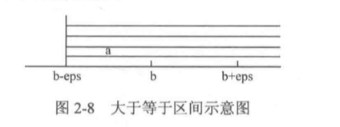
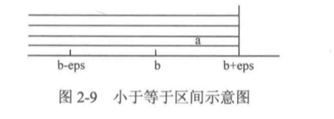
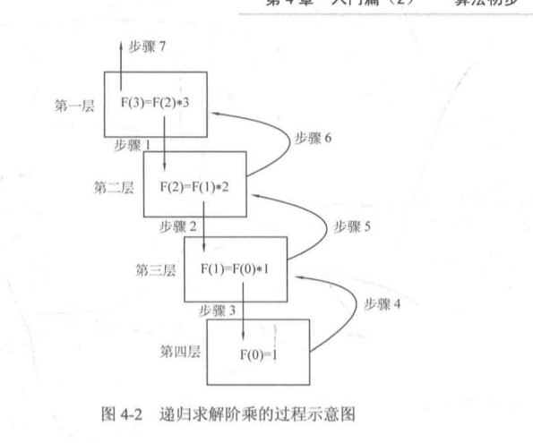
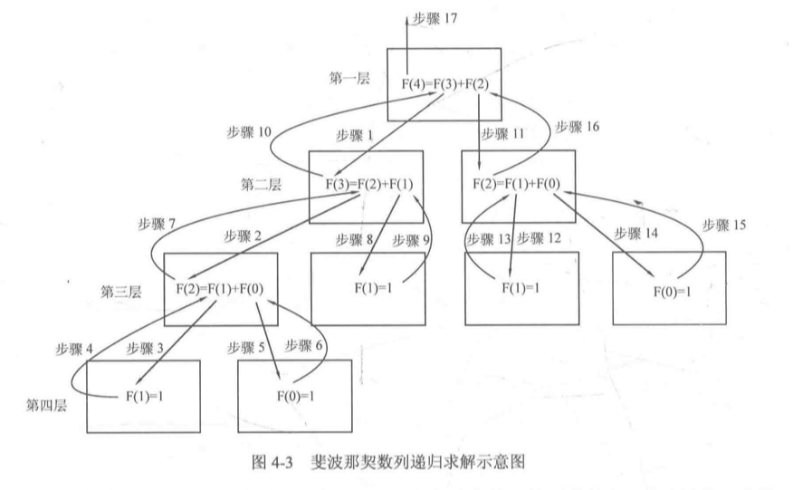
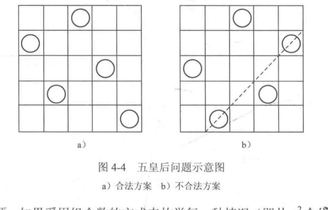
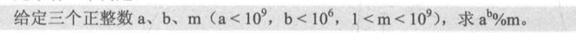
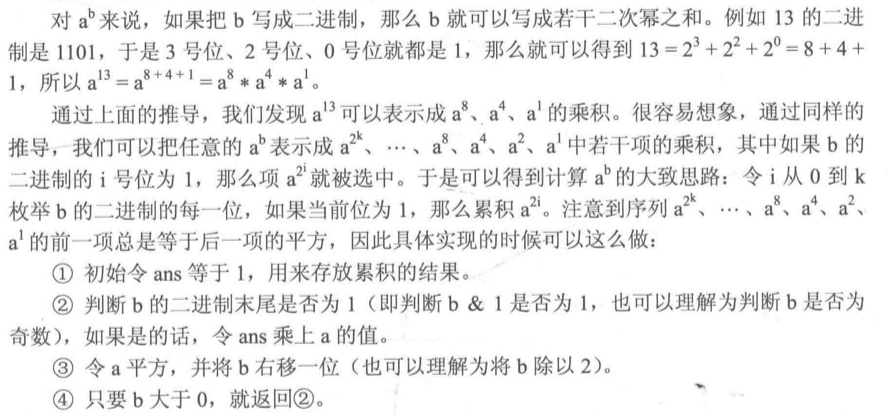
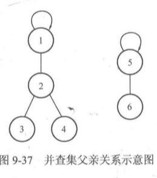
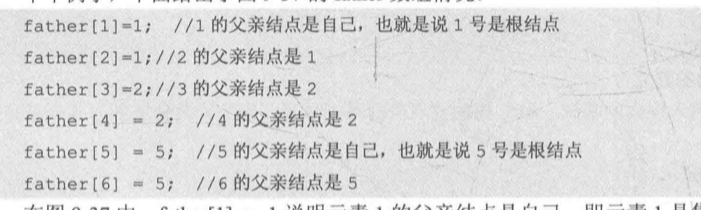
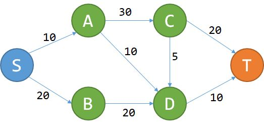

# 算法笔记

## C/C++快速入门

### 格式化输出

1.  `%md`,可以使不足m位的int型变量以m位进行**右对齐**输出；超出m位的变量，则保持原样输出
2.  `%0md`, 不足m位时，补充足够数量的0
3.  `%.mf`, 使浮点数保留m位小数输出。

### 常用math函数

C语言提供使用的数学函数，include math.h文件

1.  fabs(double x)

    对double类型变量取绝对值。

2.  floor(double x) 和 ceil(double x)

    分别同于double变量向下取整和向上取整，返回double类型。

3.  pow(double r, double p)

    用于返回r的p次幂。

4.  sqrt(double x)

    返回double类型变量的算数平方根。

5.  log(double x)

    返回double类型以2为底的对数，不提供任意底数的对数函数求法，可以使用换底公式

6.  sin(double x), cos(double x), tan(double x)

    参数要求弧度制：例，sin(pi * 45/180)

7.  round(double x)

    将double类型变量x四舍五入，返回类型也是double类型。

### memset函数

需要添加头文件string.h, 使用格式：

`memset(数组名，值，sizeof(数组名))；`

一般赋值0或-1，赋值其他数字使用fill函数。

### string.h头文件

用于处理字符数组

1.  strlen(字符数组)

    返回字符数组中第一个\0之前的字符个数。

2.  strcmp(字符数组a， 字符数组b)

    按照字典序比较两个字符串，如果a<b则返回一个负整数；如果a=b则返回0；如果a>b则返回一个正整数。

3.  srcpy(字符数组trg,字符数组rhs)

    将字符数组rhs复制给字符数组trg，复制包括结束符\0

4.  strcat(字符数组a，字符数组b)

    将字符数组b接到字符数组a后面。

5.  sscanf与sprintf

    例：sscanf(str, "%d", &n); //将str字符串数组内容以整型输入到n变量中。

    例：sprintf(str, "%d", n); //将n以整型格式输入到str字符数组中。

### 数组参数

函数的参数可以是数组，一维数组不需要填写长度，二维数组第二维需要填写长度。数组名退化为指针，使用sizeof可证明。

### 补充

#### 数据类型选择

一般数量级在1e9以下的选择int，等于选择long int；1e9以上的选择long long，并在数据末尾初始化时加上LL。

#### 浮点数比较

浮点数在计算机中存储并不总是精确的，经过大量计算后，浮点数3.14可能存储成3.14000000001，或者3.139999999999，这对后续的操作如"=="运算符使用造成干扰。这时引入一个极小数eps来对误差进行修正。

"=="运算符

如果一个数a落在[b-eps, b+eps]区间中，就应当判定 a==b 成立。经验取eps=1e-8比较合适。

```cpp
const double eps = 1e-8;
#define Equ(a,b) ((fabs((a)-(b))) < (eps))
```

类似的，对于">"运算符和"<"运算符，



```cpp
// > 
#define More(a,b) (((a)-(b))>(eps))
// <
#define Less(a,b) (((a)-(b))<(-eps))
// >= 大于等于，a下限应该在b左侧eps位置
#define MoreEqu(a,b) (((a)-(b))>(-eps))
// <= 小于等于，a上限应该在b右侧eps位置
```



#### 圆周率

由$cos(\pi)=-1$知$\pi=arccos(-1)$, 因此有

`const double Pi = acos(-1.0)`

## 模拟

一般设置测试数组为上限+一个较小常数。例如题目给出数据上限1e5，则设置测试数组大小为1e5+1e3. 防止数组段错误，溢出范围。

## 算法初步

### 散列

由一个简单问题引入：给出N个正整数，再给出M个正整数，问这M个数中每个数是否在N个数中出现过，其中N,M<=1e5，且所有正整数不超过1e5. 例如N=5, M=3, N个正整数为{8, 3, 7, 6, 2}, 欲查询M个整数{7, 4, 2}。

解决这个问题最直观的思路是：欲查询正整数x，遍历所有N个数，看是否存在一个数与x相等。但这种做法的时间复杂度为O(MN)，当NM很大时，显然无法接受的。

一般改进方案是使用空间换取时间，设定一个bool型数组hashTable[N]，其中hashTable[x]=true表示正整数x在N个数中出现过，在M次查询时每一次耗时仅为O(1)，所以算法总时间为O(M+N)。

然而改进的方案在存储数据数量级别足够大1e9时，若直接使用下标则是不可行的。这时出现这样的概念：将元素通过一个函数转换为可接受范围内的整数，该整数可以尽量唯一地代表这个元素。这个函数就是散列函数。

#### 字符串hash

目的在于将一个字符串S映射为一个整数，该整数尽可能唯一表示这个字符串S。

假设字符串由大写字母A~Z构成，其整数表示则为0~25，于是设计成一个二十六进制表示的字符串。然后由二十六进制转换为十进制，每个字母得到的十进制数是唯一的，于是就可以将字符串映射成整数。注意，如果字符串长度len过长，转换成的整数会很大。

```cpp
int hashFunc(char S[], len){
    int id=0;
    for(int i = 0;i<len; ++i)
        id = id*26 + (S[i]-'A');
    return id;
}
```

扩展大写字母到字符串有大小写字母，将a~z映射为26~51，这样就变成了五十二进制转换为十进制。

### 递归

#### 分治

分治(divide and conquer)，分而治之。将原问题划分为若干个规模较小与原问题相同或者相似的子问题，然后分别解决这些子问题，最后合并子问题的解，即得到原问题的解。

需要明确的是，分治法解决的子问题应当是相互独立的。

递归中存在两个重要条件：

1.  递归边界
2.  递归调用

经典递归调用例子：使用递归求解n的阶乘

$n! = 1*2*3*…*n$

```cpp
int F(int n){
    if(n==0)
        return 1;
    else 
        return F(n-1)*n;
}
```



另外一个经典例子：Fibonacci数列

求Fibonacci数列的第n项。数列：1, 1, 2, 3, 5, 8, 13, … , F(0) = 1, F(1) = 1, F(n) = F(n-1)+F(n-2), n>=2

```cpp
int F(int n){
	if(n==0 || n==1)
        return 1;
    else
        return F(n-1)+F(n-2);
}
```



#### 全排列问题

全排列(Fyiull Permutation)，将1~n这n个数所能形成的所有排列，按照字典序输出。

将问题分解，将1~n个数输出：输出以1开头的全排列，输出以2开头的全排列，… ，输出以n开头的全排列。设定一个数组P，存放当前序列；再设定一个散列数组hashTable，当整数x已经在P数组时，设置hashTable[x]=true。

在P中，从第1位到第n位填入数字。

1.  将第1位填入1~n中某个数字x，设置hashTable[x]=true;
2.  直到在index-1位填入1~n中未被标记为true的数字x，并标记该x。
3.  处理当前index，填入P，并标记。
4.  处理第index+1位，进行递归。
5.  递归执行完，表示当前index可以更换值了，设置x为false，并填写下一个数字。

```cpp
const int maxn = 11;
// 标记x是否被使用过 
bool hashTable[maxn] = {false};
// 存储当前排列的数组
int n;
int P[maxn] = {0};

void printP(int P[]){
    for (int i = 1; i <= n; i++)
    {
        printf("%d ", P[i]);
    }
    printf("\n");
}

void generateP(int index){
    if(index > n){
        // 输出P
        printP(P);
        return;
    }
        
    int x;
    // 找到未被标记的x
    for (x = 1; x<= n; x++)
    {
        if(!(hashTable[x])){
            // 将x放入P数组index位置，并标记 
            P[index] = x;
            hashTable[x] = true;
            // 处理下一个位置index+1
            generateP(index+1);
            // 处理完后标记x未使用，使用下一个x
            hashTable[x] = false;
        }
    }
    
}
```

#### n皇后问题

n皇后问题是指在一个n*n的国际象棋棋盘上放置n个皇后，使得这n个皇后两两均不在同一行、同一列、同一条对角线上，求合法的方案数。



若采用枚举的方法，需要$C_{n*n}^{n}$次计算，如果n=8时，枚举量高达54502232次。显然无法承受。

如果每行只放置一个皇后，每列也只能放置一个皇后，那么这些皇后所在的行号会是一个1~n的排列。

在全排列的基础上，增加判断是否在对角线上。关于对角线对称的两个顶点，横坐标相减的绝对值等于纵坐标相减的绝对值。

```cpp
if(index > n){
        bool flag = false;
        // 判断每两个皇后是否违背对角线原理
        for (size_t i = 1; i <= n; i++)
        {
            for (size_t j = i+1 ; j <= n; j++)
            {
                if(abs((int)(i-j)) == abs((int)(P[i]-P[j]))){
                    // 存在对角线上的两个元素
                    flag = true;
                    break;
                }
            }
            if(flag)
                break;
        }
        if(!flag){
            count++;
        }
        return;
    }
```

优化方案：事实上，在排列顺序的时候，就有可能存在两个元素已经冲突了，在判断出冲突后直接返回递归上一层即可。

称之为回溯法。

```cpp
// 找到未被标记的某个x
    for (x = 1; x<= n; x++)
    {
        if(!(hashTable[x])){
            // 将x放入P数组index位置，并标记 
            P[index] = x;
            hashTable[x] = true;
            // 判断是否存在两个元素对角线冲突
            bool flag = false;
            for(size_t i = 1; i < index; ++i){
                if(abs((int)(i-x)) == abs((int)(P[i]-P[index]))){
                    flag = true;
                    break;
                }
            }
            if (flag)
            {
                // 处理完后标记x未使用，使用下一个x
                hashTable[x] = false;
                continue;
            }
            
            // 处理下一个位置index+1
            generateP(index+1);
            // 处理完后标记x未使用，使用下一个x
            hashTable[x] = false;
        }
    }
```

### 贪心算法

#### 简单贪心

贪心法是求解一类最优化问题的方法，它总是考虑在当前状态下局部最优(或者较优)的策略，来使全局的结果达到最优。如果采取的不适最优，则全局结果也不是最优的。证明贪心策略的一般过程是，使用反证法和数学归纳法，假设策略不能导致最优解，然后通过一系列的推导来证明矛盾，以此证明策略最优。

栗子1 月饼供应求最大营销额

题目：给出所有种类月饼的库存量、总售价以及市场需求量，计算获得的最大收益。样例：假如有三种月饼，其库存量分别为18、15、10万吨，总售价分别为75、72、45亿元，如果给出市场需求量20万吨，那么最大收益的策略应该是卖出单价最高的15万吨2种类，和5万吨3种类，最后计算获得最大收益为94.5亿元。

思路：

总是采用单价最高的月饼出售，即可获得最大利润。

步骤1. 计算出单价并降序排序。

步骤2. 从单价最高的月饼种类开始枚举，如果该种月饼库存量不足需求量，则将其全部卖出，此时需求量自减该库存量，收益自加总价；如果足够供应需求量，则只提供需求量大小的量，并计算收益单价*需求量，并将需求量减为0.

注意：

1.  库存量题目告知为正数，却不一定是整数，所以应设置为double类型，其他单价同理也应为double类型。

参考代码：

```cpp
/* File Info 
 * Author:      cKrazy 
 * CreateTime:  4/16/2020, 9:28:17 AM 
 * LastEditor:  cKrazy 
 * ModifyTime:  4/16/2020, 9:28:18 AM 
 * Description: 
 * 销售月饼 获取最大销售额
*/ 

#include <cstdio>
#include <vector>
#include <algorithm>

typedef struct mooncake
{
    double store; // 库存量
    double price; // 总售价
    double per_price; // 单价
    mooncake(): store(-1.0), price(-1.0), per_price(-1.0){}
} mooncake;

// 按照降序排列
bool cmp(mooncake &a, mooncake &b){
    if(a.per_price>b.per_price) return true;
    else
    {
        return false;
    }
    
}

int main(){
    unsigned int N;
    double D, prefit = 0.0;
    while(scanf("%d %lf", &N, &D) != EOF){
        std::vector<mooncake> moonTypes;
        for (size_t i = 0; i < N; i++)
        {
            mooncake temp;
            scanf("%lf", &temp.store);
            moonTypes.push_back(temp);
        }
        for (size_t i = 0; i < N; i++)
        {
            scanf("%lf", &moonTypes[i].price);
            moonTypes[i].per_price = moonTypes[i].price/moonTypes[i].store;
        }
        // 排序mooncake类型 
        // 降序排列 比较cmp函数将a>b返回真
        std::sort(moonTypes.begin(), moonTypes.end(), cmp);

        for (size_t i = 0; i < N && D > 0.0; i++)
        {
            if(D > moonTypes[i].store){
                // 单个月饼种类不足
                D -= moonTypes[i].store;
                prefit += moonTypes[i].price;
            }
            else
            {
                // 单个月饼种类能满足市场
                prefit += D*moonTypes[i].per_price;
                D = 0.0;
            }
        }
        printf("%.2lf\n", prefit);
        
    }
    
    
    return 0;
}


```

### 二分查找

#### 有序序列

猜数字，每次选择当前范围的中间数猜，

二分查找是基于有序序列的查找算法，其高效之处在于每一步都可以去除当前区间中一半元素。故其时间复杂度是O(logN)的。

示例:

```cpp
int binarySearch(int A[], int left, int right, int x){
	int mid;
	while(left <= right){
		mid = (left+right)/2;
		// 为了避免int类型数据过大使用
		// mid = left +(right-left)/2;
		if(A[mid]==x) return mid;
		else if(A[mid]>x){
			// 中间数大于x
			right = mid -1;
		}else{
			// 中间数小于x
			left = mid+1;
		}
	}
	// 查找失败 返回-1
	return -1;

}
```

利用二分查找的思想，在递增的序列里找到一个区间`[L,R)`，L为第一个大于等于x的元素下标，R为第一个大于x的元素下标。该区间就是求解可重复元素x在序列的下标范围。

```cpp
// 返回数组中第一个大于等于x的元素 A为递增序列
int lower_bound(int A[], int left, int right, int x){
    int mid;
    while(left < right){
        // 防止int溢出
        mid = right + (left-right)/2;
        if(A[mid] >= x){
            right = mid;
        }else{
            left = mid + 1;
        }
    }
    return left;
}

// 返回数组中第一个大于x的元素
int upper_bound(int A[], int left, int right, int x){
    int mid;
    while(left<right){
        mid = right/2 + (left-right)/2;
        if(A[mid] > x){
            right = mid;
        }else{
            left = mid + 1;
        }
    }
    // 跳出循环的条件为left == right
    return left;
}
```

lower_bound函数 和upper_bound函数都是在解决：寻找有序序列中第一个满足某条件的元素的位置。平时碰到的大部分二分法问题都可以归结此问题。而条件编写的位置在于第7行和第21行if条件。

#### 拓展

可以用来求解数学中函数根的问题，利用已知根的范围，二分法迫近最优解。即每次判断f(mid)与0的差有多大。

```cpp
// 水桶装水面积比的问题
const double PI = acos(-1.0);
// 输入R,r 求h
double function2(double R, double h){
    // 结果r关于h递增的
    double alpha = 2 * acos((R-h)/R);
    double r = 2 * alpha * cos((R-h)/R) / PI;
    return r;
}

double solution(double R, double r){
    double left, right, mid;
    left = 0; right = R;
    while (std::abs(left - right) > eps)
    {
        mid = right + (left - right)/2.0;
        if(function2(R, mid) > r){
            // 所求的比例大于题目给定比例 h应在更左侧区间
            right = mid;
        }else{
            left = mid;
        }
    }
    return left;
}

```

funtion的内容不必太过注意，大体上就是传入R和h求出一个比例r；在solution中，给定范围left~right为0~半径R，h就是这个范围的可变量，每次为范围的中值mid，将其传入function的出的比例与给定r比较。由于function是单调递增的，所以对范围的缩小方向就很清楚。

#### 快速幂



若按照数学解题思路有：

`a*a*…*a(共b个)%m`。

但是C++数据类型中，最大长度的64位长整型long long，最大表示范围为`-2^63-2^63`，大概是10^19. 当a起始数值就很大时，会出现溢出问题。

所以应该对不必要的位进行剪枝，最后求m的模运算，所以每次幂运算完后，对m进行模运算，保存余数即可。这样就避免了溢出问题。

使用c++编写程序入下：

```
int a, b , m;
int ans = 1;
while(b!=0){
	ans = ans * a %m;
	b--;
}
```

算法耗时为O(b)

当题目中b改为1e18，上述算法则会计算超时。

这时使用二分的思想，从顶层开始，每次计算a的一半次幂，一半的值可能是奇数，也可能是偶数。

若b为偶数，a^b即可使用二分 = a^b/2 * a^b/2, 接下来求解一次a^b/2即可，递归执行到b=0；

若b为奇数，a^b可以写成 = a^(b-1) * a , 此时的b-1必然为偶数。

```
long long binaryPower(long long a, long long b, long long m){
    if(b == 0){
        return 1;
    }
    if(b%2==0){
        // b为偶数
        long long binaryPower_ans = 1;
        binaryPower_ans = binaryPower(a, b/2, m); 
        return binaryPower_ans * binaryPower_ans % m;
    }
    else{
        return a * binaryPower(a, b-1, m) %m;
    }

}
```

使用二分加递归，使得时间复杂度降为O(logN).

注意，若一开始a就比m大，进入函数就得立即模运算。

还有一种方法，使用迭代而非递归，思路是取b的二进制，表示当前迭代a乘方位置。



```
// 使用迭代法
long long binaryPower1(long long a, long long b, long long m){
    long long ans = 1;
    a = a%m;
    while(b!=0){
        if(b&1){
            // b末尾有效
            ans = ans*a%m;
        }
        // a迭代 自增一倍
        a = a*a%m;
        // b二进制向右移动一位
        b = b>>1;
    }
    return ans;
}
```

### 算法应用技巧

#### 双指针ij

two pointers是算法中比较重要的编程思想，可以有效地提高算法效率。

栗子：给定一个递增的正整数序列和一个正整数M，求序列中两个不同位置ab，使它们的和恰好为M。

最基本的想法是，i和j暴力枚举，挨个判断两个数相加是否等于M。

显然暴力算法的时间复杂度是O(n^2). 当n>1e5时，算法超时。

暴力算法未利用到题目的条件之一，序列是递增的，所以两个相加的结果若已经大于M，完全没必要继续移动他们。

对所有情况分析：

1.  如果A[i]+A[j] == M, 剩余查询区域只可能在i~j区间；
2.  如果A[i]+A[j] < M, 剩余查询区域只可能在i+1~j
3.  如果A[i]+A[j] > M, 剩余查询区域只可能在i~j-1。

反复执行上述三个过程，直到ij相遇，即i<j不满足.

i,j 开始分别指向数组的首和尾。

```cpp
while(i<j){
	if(a[i]+a[j] == M){
        cout<<i,j<<;
        i--;
        j--;
    }else if(a[i]+a[j] < M){
        i++;
    }else{
        j--;
    }
}
```

问题 这里为什么没有回退指针呢。

分析复杂度，ij分别从首尾移动，直到二者相遇停止，所以时间复杂度为O(n).

另外对两个序列的merge也用到双指针。

对序列的2路-归并排序则是使用递归执行了左右子序列的merge。

使用左右指针设计的快速排序。

```cpp
/ partition 将[left, right]左右两半部分用pivot分开
// pivot选取left
int partition(int A[], int left, int right){
    int pivot = A[left];
    while(left<right){
        // 交换左右两个部分 分别处于pivot大小侧
        // 先移动右侧部分
        while(A[right]>pivot&&left<right)
            right--;
        A[left] = A[right]; 

        while(A[left]<=pivot&&left<right)
            left++;
        A[right] = A[left]; 
    }
    // 最后结束时ij相遇
    A[left] = pivot;
    return left;
}

void quickSort(int A[], int left, int right){
    if(left < right){
        int pos = partition(A, left, right);
        quickSort(A, left, pos-1);
        quickSort(A, pos+1, right);
    }
}
```

快速排序算法当序列中元素的排序比较随机是效率最高，但是当序列中元素接近有序时，会达到最坏的时间复杂度O(N^2)，产生的原因是选择的left作为pivot并没有把序列切分成两部分长度接近的子区间。解决方案是，使用随机数，随机选择区间某个值最为pivot，期望的时间复杂度能达到O(NlogN).

#### 打表

对于可能大量重复计算的数据，将其存储在数组中，下次需要时从数组取出即可。

## 搜索

### 深度优先搜索

DFS，是一种枚举所有完整路径以遍历所有情况的搜索方法。使用递归可以很好地实现深度优先搜索，因为递归式相当于岔道口，递归边界类似于死胡同。

背包问题使用DFS，

有n件物品，每件物品的重量为w[i], 价值为c[i]. 现在需要选出若干件物品放入容量为v的背包中，求一种方案，使背包中物品的价值之和最大。求最大值。

显然，每次都要对物品进行选择，因此DFS函数中参数需要记录当前物品的index，依据题目需求，还要传入当前背包总重量以及总价值进行判断。

`int DFS(int index, int sumW, int sumC){}`

如果不放入index号物品，那么sumW和sumC就不变，接下来处理index+1分支，即前往`DFS(index + 1, sumW, sumc)`; 而如果选择放入index号物品，那么sumW将增重该物品的重量w[index], 且价值应该增加c[index], 接着处理index+1号物品，即前往`DFS(index + 1, sumW + w[index], sumC + c[index])`

当index增长到n，说明所有物品已经处理完毕，此时记录的sumW和sumC就是所选物品的总重量和总价值。全局记录一个最大价值变量maxValue，每次sumC计算后更新之。

```cpp
const int maxn = 30;
int n,V, maxValue = 0; // 物品件数n，背包容量，最大价值变量
int w[maxn], c[maxn]; // 物品的重量与价值
void DFS(int index, int sumW, int sumC){
    if(index == n){
        // 递归边界。 所有物品遍历一次
        if(sumW < V && sumC > maxValue){
            maxValue = sumC;
        }
        return ;
    }
    DFS(index + 1, sumW, sumC); // 不放入index物品
    DFS(index + 1, sumW+w[index], sumC+c[index]); // 放入index物品
}

DFS(0, 0, 0);
```

**分析**

由于每件物品有两种选择，所以上述算法时间复杂度达到O(2^n), 当n很大时，显然不能接受的。

所以对代码进行优化，当重量已经达到V时，不必再继续递归了。

```cpp
void DFS(int index, int sumW, int sumC){
	if(index == n){
        return;
    }
    DFS(index+1, sumW, sumC); // 不选择index物品
    if(sumW + w[index] <= V){  // 选择index物品
        if(sumC + v[index] > maxValue)
        	maxValue = sumC + v[index];
        DFS(index+1, sumW+w[index], sumC+c[index]);
    }
}
```

由题目条件对算法进行限制，称之为剪枝。

事实上，DFS适用于这种，给定一个序列，枚举这个序列的所有子序列，根据条件选择最优子序列。

例如对于N个整数，选择K个数，使得这K个数的和恰好等于给定整数X，如果有多个方案，选择平方和最大的一个。

与背包问题类似，记录当前处理的整数编号index，由于要选择K个数，所以传入参数num来记录当前已经选择的数的个数；另外需要sum和sumSqu分别记录当前已选择数的和与平方和。

`void DFS(int index, int num, int sum, int sumSqu){}`

```cpp
vector<int> temp,ans;
void DFS(int index, int num, int sum, int sumSqu){
	if(num ==k && sum ==x){
        if(sumSqu>maxSumSqu){
            maxSumSqu = sumSqu;
            ans = temp;
        }
        return;
    }
    // 已经处理完n个数则返回
    if(index == n || num>k || sum>x) return;
    temp.push_back(A[index]);
    DFS(index+1, num+1, sum+A[index], sumSqu+A[index]*A[index]);
    // 不选择index数
    temp.pop_back();
    DFS(index+1, num, sum, sumSqu);
}
```

### 广度优先搜索

BFS，breadth first search

当碰到岔道口时，总是先依次访问从该岔道口能直接到达的所有结点，然后按照这些结点访问的顺序去依次访问它们能直接到达的所有结点，依次类推，直到所有结点被访问为止。

广度优先搜索一般使用队列实现，且总是按照层次顺序进行遍历。

模板：

1.  定义一个队列queue，并将第一个顶点s入队
2.  while循环，循环条件队列queue非空
3.  循环中，读取首元素top，并访问之，访问完后将其出队
4.  top下一层所有未读取过的结点入队，标记他们已经读取过
5.  循环2步骤

### 并查集

并查集是一种维护集合的数据结构，并查集分别取自Union(合并)、Find(查找)、Set(集合)。

并查集其实就是使用一个数组实现的，

`int father[N]`





在这个实例中存在两个不同的集合，由两个根节点1，5构成。

#### 并查集基本操作

**初始化**

对于father数组，每个元素初始化为自身。

```cpp
for(int i=1; i<=N; ++i)
	father[i] = i;
```

**查找**

规定了同一个集合中只存在一个根节点，查找操作就是寻找当前结点的根节点，实现方式可以使递推或者递归。

```cpp
int findFather(int x){
	while(x!=father[x])
		x = father[x];
	return x;
}
```

```cpp
int findFather(int x){
	if(x==father[x]) return x; // 根节点
    else
        return findFather(father[x]);
}
```

**合并**

一般给出两个元素，将二者所在的集合合并。首先要判断两个元素是否属于同一个集合，只有两个集合属于不同集合时才合并，合并的过程就是把其中一个集合的根结点的父亲结点设置为另一个集合的根结点。

```cpp
void Union(int a, int b){
	int faA = findFather(a);
	int faB = findFather(b);
	if(faA != faB){
		faA = father[faB];
	}
}
```

#### 

## 动态规划

从简单问题开始

钞票找零问题，若钞票面值为1、5、10、20、50、100构成，仅仅使用贪心策略，为凑出某个金额w，是容易且正确的。但是当钞票面值发生改变，如1，5，11，在凑出w=15时，使用贪心策略会发生错误。因为贪心总是选择最能满足当前局部的条件，即会选择11来降低w，然而这样需要`11*1+1*4`共5张，而观察之，选择`5*3`共3张为最优解。

分析之，对每种情况进行数学方法分析。

假设$f(w)$为凑够w金额所需最小钞票数，则

-   取11：cost  = $f(4)$ + 1 = 4 + 1 = 5
-   取5：cost = $f(10)$ + 1 = 2 + 1 = 3
-   取1：cost =  $f(14)$ + 1 = 4 + 1 = 5

注意暂时不要关心$f(4)$为什么得4。

从上述cost计算知：

$f(n) = min\{f(n-1), f(n-5), f(n-11)\} + 1$

从1开始，计算所有最小cost的$f(n)$即可

```c++
#include <cstdio>
#include <cstdlib>
#include <cmath>
#include <climits>
#include <algorithm>

int main(){

    int F[105], i, n, cost;
    scanf("%d", &n);

    F[0] = 0;

    for(int i = 1; i <= n; ++i){
        cost = INT_MAX;
        // 计算选择各种钞票的cost
        // 后选择其中最小的cost 
        // 这里保存每一中选择的cost，并在后面的选择中继续比较
        if(i-1>=0)
            cost = std::min(F[i-1] + 1, cost);
        if(i-5>=0)
            cost = std::min(F[i-5] + 1, cost);
        if(i-11>=0)
            cost = std::min(F[i-11] + 1, cost);
        // 最终确定当前w的最优化选择
        F[i] = cost;
        printf("f[%d]=%d\n", i, F[i]);
}

    return 0;
}
```

上述代码使用O(N)的复杂度解决了cost问题，其原理：

-   f(n) 只与 f(n-1), f(n-5), f(n-11)的值有关
-   只关心f(w)的值，不关心它是怎么凑出来的

与暴力搜索的方法不同，为了求出f(15), 只需知道f(14), f(10), f(4)的值，舍弃了冗余信息。

为了求出f(n)，只需要知道更小的几个f(c)，也就是求解f(n)的子问题，这就是动态规划问题(dynamic programming)。

#### 无后效性

一旦f(n)确定，如何凑出的f(n)就不用管了。

如果给定某一阶段的状态，则在这一阶段以后的过程的发展将不受这阶段以后各段状态的影响。

#### 最优子结构

f(n)的定义为凑出n所需要**最少**钞票数量，即f(n)已经是最优，然后计算w分别为14，10，4的最优解，即为w=15的最优解。

大问题的最优解可以由小问题的最优解推出，称之为最优子结构性质。

#### 典型应用

无环有向图，S->T费用最少选择路线。



记S到P最少花费费用为f(P)

由图知，$f(T) = min\{f(C)+20, f(D)+10\}$,

看起来，使用DP是可以解决该问题的

使用拓扑排序算法 TODO

迪杰斯特拉算法

**最长上升子序列**

给定长度n的序列a，从a中抽取一个子序列，这个子序列需要单调递增，问最长的上升子序列(LIS)的长度。例如：1,5,3,4,6,9,7,8的LIS为1,3,4,6,7,8，长度为6。

设计方法：

1.  设计状态(我是谁)
    记f(x)为以ax结尾的LIS长度，答案则为max{f(x)}.
2.  状态x从哪里推过来(我从哪里来)
    考虑比x小的每一个p，如果ax>ap, 那么f(x)可以取f(p)+1.

```
int n, f[105]={0}, a[105]={0};
    scanf("%d", &n);
    for (size_t i = 1; i <= n; i++)
    {
        scanf("%d", &a[i]);
        f[i] = 1;
    }

    for (size_t x = 1; x <= n; x++)
    {
        for (size_t p = x; p > 0; p--)
        {
            if(a[x]>a[p])
                f[x] = std::max(f[p]+1, f[x]);
        }
        printf("f[%ld]=%d\n", x, f[x]);
    }
    int ans = 0;
    for (size_t i = 1; i <= n; i++)
    {
        ans = std::max(ans, f[i]);
    }

    printf("%d", ans);
    
    return 0;
```

解决此问题，两层for循环，复杂度O(N2).

在第二层循环，向前遍历了每一个元素，判断是否能划入子序列，这样造成不必要的浪费，因为有的元素太大，与当前元素差太多，即可使用二分查找，降低维度，达到O(NlogN)的耗时。

所以优化策略为，在f数组中保存当前元素最小子序列末尾元素的值，f必然是单调增的，通过比较值来二分查找。

```
int n;
    cin>>n;
    for(int i=1;i<=n;i++)
    {
        cin>>a[i];
        f[i]=0x7fffffff;
        //初始值要设为INF
        /*原因很简单，每遇到一个新的元素时，就跟已经记录的f数组当前所记录的最长
        上升子序列的末尾元素相比较：如果小于此元素，那么就不断向前找，直到找到
        一个刚好比它大的元素，替换；反之如果大于，么填到末尾元素的下一个q，INF
                就是为了方便向后替换啊！*/ 
    }
    f[1]=a[1];
    int len=1;//通过记录f数组的有效位数，求得个数 
    /*因为上文中所提到我们有可能要不断向前寻找，
    所以可以采用二分查找的策略，这便是将时间复杂
    度降成nlogn级别的关键因素。*/ 
    for(int i=2;i<=n;i++)
    {
        int l=0,r=len,mid;
        if(a[i]>f[len])f[++len]=a[i];
        //如果刚好大于末尾，暂时向后顺次填充 
        else 
        {
        while(l<r)
        {   
            mid=(l+r)/2;
            if(f[mid]>a[i])r=mid;
    //如果仍然小于之前所记录的最小末尾，那么不断
    //向前寻找(因为是最长上升子序列，所以f数组必
    //然满足单调) 
            else l=mid+1; 
        }
        f[l]=min(a[i],f[l]);//更新最小末尾 
        }
    }
    cout<<len;
```

**最长公共子串**

对两个串text1和text2设置`dp[i][j]`, 表示text1第i个字符对应text2第j个字符之间的最长公共子串长度。

策略：

若i与j匹配，最长公共子串长度`dp[i-1][j-1]`+1，

若不匹配，最长公共子串取`max{dp[i-1][j], dp[i][j-1]}`

```c++
class Solution {
public:
    int longestCommonSubsequence(string text1, string text2) {
        size_t len_1 = text1.length();
        size_t len_2 = text2.length();

        std::vector< std::vector<int> > dp(len_1+1);
        for(size_t i = 0; i < len_1+1; ++i){
            dp[i].assign(len_2+1, 0);
        }

        for(size_t i = 1; i <=len_1; ++i){
            for(size_t j = 1; j <= len_2; ++j){
                if(text1[i-1] == text2[j-1]){
                    // 匹配上
                    dp[i][j] = dp[i-1][j-1] + 1;
                }
                else{
                    // 未匹配
                    dp[i][j] = std::max(dp[i-1][j], dp[i][j-1]);
                }
            }
        }
        return (int)dp[len_1][len_2];

    }
};
```

**最长回文子串**

```cpp
class Solution {
public:
    string longestPalindrome(string s) {
        int len = s.length();
        int max_len = 1; // 最长回文子串记录值
        int start = 0;
        std::vector<std::vector<int> > dp(len);
        for(int i = 0; i<len; ++i){
            dp[i].assign(len, 0);
        }
        // 对边界初始化
        for(int i = 0; i < len; ++i){
            dp[i][i] = 1;
            if(i+1<len && s[i] == s[i+1]){
                dp[i][i+1] = 1;
                max_len = 2;
                start = i;
            }
        } 
        // main
        for(int L=3; L<= len; ++L){
            for(int i = 0; i+L-1<len; ++i){
                int j = i+L-1;
                if(s[i]==s[j]){
                    dp[i][j] = dp[i+1][j-1];
                    if(dp[i][j]==1 && j-i+1 > max_len){
                        max_len = j-i+1;
                        start = i;
                    }
                }
            }
        }
        return  s.substr(start, max_len);
    }
};
```


#### 背包问题

若不加01表示可以将物品拆分，排序单价并使用贪心策略即可。

01背包问题是在M件物品中取出若干件放在空间W的背包中，每件物品的体积分别为W1, W2, … , Wn, 与之相对应的价值为P1, P2, … , Pn. 求解这个背包能装的最大价值。

状态转移方程：判断当前背包剩余空间为j时，是否还能装入第i个物品，使总价值增加。

`d[j] = max(d[j], d[j-v[i]] + w[i])`

v[i]表示第i个物品的体积，w[i]表示第i个物品的价值。


有一个贼在偷窃一家商店时，发现有n件物品，第i件物品价值vi元，重wi磅，此处vi与wi都是整数。他希望带走的东西越值钱越好，但他的背包中至多只能装下W磅的东西，W为一整数。应该带走哪几样东西？这个问题之所以称为0-1背包，是因为每件物品或被带走；或被留下；小偷不能只带走某个物品的一部分或带走同一物品两次。
——————————

  `f[i][v]`：表示前i件物品恰放入一个容量为v的背包可以获得的最大价值。

状态转移方程为：

`f[i][v]=max{f[i-1][v], f[i-1][v-weight[i]]+value[i] }`

1.  如果不放第i件物品，则问题转化为：前i-1件物品放入容量为v的背包中
2.  如果放入第i件物品，则问题转化为：前i-1件物品放入剩下的容量为v-weight[i]的背包中。

```cpp
#include <vector>
#include <iostream>
int main(){
    int N;
    scanf("%d", &N);
    int C;
    scanf("%d", &C);
    std::vector<int> weight(N+1), value(N+1);
    std::vector<std::vector<int> > f(N+1);
    for (size_t i = 0; i < N+1; i++)
    {
        f[i].assign(C+1, 0);
    }
    
    for (size_t i = 1; i <= N; i++)
    {
        scanf("%d",&value[i]);
    }
    for (size_t i = 1; i <= N; i++)
    {
        scanf("%d",&weight[i]);
    }
    /*
    3 5        
	60 100 120
	1 2 3
   0    0    0    0    0    0 
   0   60   60   60   60   60 
   0   60  100  160  160  160 
   0   60  100  160  180  220 
	220%                            
    */
    // 遍历每件物品 将其放入背包
    for (size_t i = 1; i <= N; i++)
    {
        // 计算每个空间差下最大价值
        for (int v = 1; v <= C; v++)
        {
            if(v < weight[i]){
                // 空间不足以放入i物品 则为之前物品放入背包的最大价值问题
                f[i][v] = f[i-1][v];
            }
            else{
                // 状态转移
                // 若不放入第i件物品
                int x = f[i-1][v];
                // 若放入第i件物品
                int y = f[i-1][v-weight[i]] + value[i];
                f[i][v] = std::max(x, y);
            }
        }
        
    }

    for (int i = 0; i <= N; i++){
        for (int j = 0; j <= C; j++){
            printf("%4d ", f[i][j]);
        }
        std::cout << std::endl;
    }

    // 最大价值的必然为f[N][C]
    printf("%d", f[N][C]);
    return 0;
    
}
```

寻找路径：

```
cout << endl << "选取的最大价值是：" << f[N][C] << endl;
    cout << "选取的物品如下：" << endl;
    i = N, j = C;
    while (i)
    {
        if (f[i][j] == (f[i - 1][j - weight[i]] + value[i]))
        {
            cout << i << ":" << "weight=" << weight[i] << ", value=" << value[i] << endl;
            j -= weight[i];
        }
        i--;
    }
 
    cout << endl;
    return 0;

```

