# DataStruct-Notes

## 引论

### 数学知识

列出一些需要记住或是能够推导出的基本公式，并且附上基本的证明方法。

#### 指数

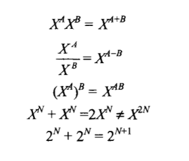

#### 对数

在计算机科学中，所有的对数都是以2为底的，除非另有声明。

$X^A=B$ 等价于 $logX_B=A$ .

$log_AB=\frac{log_CB}{log_CA}$, A,B,C>0, A!=1

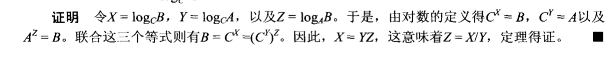

$log_AB=logA+logB$ 

其他一些有用的公式：

$logA/B=logA-logB$

$log(A^B)=BlogA$

$logX<X$对所有的X>0成立

$log1=0, log2=1, log1024=10, log1048576=20$

#### 级数

最容易记住的公式：

$\sum_{i=0}^N2^i = 2^{N+1}-1$

和

$\sum_{i=0}^NA^i=\frac{A^{N+1}-1}{A-1}$

如果0<A<1, 则有 $\sum_{i=0}^NA^i<=\frac{1}{1-A}$ , 当N趋近于无穷时，该和趋向于$1/(1-A)$

#### 模运算

#### 证明方法

**归纳法证明**

归纳法证明有两个标准的部分，第一步是证明基准情形(base case)，就是确定定理对某个(某些)小的值得正确性；接着，进行归纳假设(inductive hypothesis)，一般来说，这意味着假设定理对直到某个有限数k的所有情况都是成立的；然后使用这个假设来证明定理对下一个值(通常是k+1)也是成立的。至此定理得证(通常k是有限的)。

栗子，证明斐波那契数列，即$F_0=1, F_1=1, F_2=2, F_3=3, F_4=5, … , F_i = F_{i-1} + F_{i-2}$, 满足对i>=1, 有$F_i<(5/3)^i$.

1.  为了证明这个不等式，首先验证定理对平凡情形成立。容易验证$F_1=1<5/3$及$F_2=2<25/9$;这就证明了基准情形。
2.  假设定理对于$i = 1,2,3, … , k$ 成立；这就是归纳假设。
3.  为了证明定理，需要证明$F_{k+1}<(5/3)^{k+1}$。

根据定义有

$F_{k+1}=F_k+F_{k-1}$

将归纳假设用于等号右边，得到

$F_{k+1}<(5/3)^k+(5/3)^{k-1}$

$<(3/5)(5/3)^{k+1}+(3/5)^2(5/3)^{k+1}$

$<(3/5)(5/3)^{k+1}+(9/25)(5/3)^{k+1}$

化简：

$F_{k+1}<(3/5+9/25)(5/3)^{k+1}$

$<(24/25)(5/3)^{k+1}$

$<(5/3)^{k+1}$

定理得证。

**反证法证明**

反证法证明是通过假设定理不成立，然后证明该假设导致某个已知的性质不成立，从而证明原假设是错误的。

### 递归

递归的两个基本法则

1.  基准情形(base cases)。必须总有某些基准的而情形，他们不用递归就能求解。
2.  不断推进(making progress)。对于那些要被递归求解的情形，递归调用必须总能够朝着一个基准情形推进。

## 算法分析

### 数学基础

估计算法资源消耗是一个理论问题，因此需要一套正式的系统架构。先从数学定义开始。

1.  如果存在正整数$c$和$n_0$使得当$N>=n_0$时$T(N)<=cf(N)$, 则记为$T(N)=O(f(N))$
2.  如果存在正整数$c$和$n_0$使得当$N>=n_0$时$T(N)>=cg(N)$, 则记为$T(N) = \Omega(g(N))$
3.  当且仅当$T(N)=O(h(N))$同时$T(N) = \Omega(h(N))$，存在$T(N)=\Theta(h(N))$

例如，当N较小时，1000N要比$N^2$大；但是N=1000是转折点。令$T(N)=1000N$, $f(N)=N^2$, $n_0=1000$, $c=1$，因此我们可以说$1000N=O(N^2)$。

当我们说$T(N)=O(f(N))$时，我们是在保证函数$T(N)$是在以不快于$f(N)$的速度增长，因此$f(N)$是$T(N)$的一个**上界（upper bound）**；令一方面$f(N)=\Omega(T(N))$, 表示$T(N)$是$f(N)$的一个**下界(lower bound)**.

例如，$N^3$增长比$N^2$快，因此$N^2=O(N^3)$或者$N^3=\Omega(N^2)$；$f(N)=N^2$和$g(N)=2N^2$以相同的速率增长，从而$f(N)=O(g(N))$和$f(N)=\Omega(g(N))$都是正确的，即可以用$f(N)=\Theta(g(N))$表示。

几个重要的结论：

1.  如果$T_1(N)=O(f(N))$ 且$T_2(N)=O(g(N))$, 那么

    a. $T_1(N)+T_2(N) = O(f(N)+g(N))$, 非正式表达为$max(O(f(N)), O(g(N)))$

    b. $T_1(N)T_2(N) = O(f(N)g(N))$

2.  如果$T(N)$是一个k次多项式，则$T(N)=\Theta(N^k)$

3.  对任意常数k，$log^{k}N=O(N)$. 更直观的表示出对数增长非常缓慢

常见的函数增长率如下：

| 函数     | 名称       |
| -------- | ---------- |
| $c$      | 常量       |
| $logN$   | 对数       |
| $log^2N$ | 对数的平方 |
| $N$      | 线性       |
| $NlogN$  |            |
| $N^2$    | 二次       |
| $N^3$    | 三次       |
| $2^N$    | 指数       |

### 模型

为了在形式的框架中分析算法，我们需要一个计算模型。

我们的模型基本上是一台标准的计算机，在机器中指令被顺序地执行。该模型有一个标准的简单指令系统，如加法、乘法、比较和赋值等。为了简单起见，模型机做任意一件简单的工作都恰好花费一个时间单位。假设模型机有定长(如32位整数)并且不存在矩阵运算。假设模型机有无限内存。

### 运行时间计算

以计算$\sum_{i=1}^{N}i^3$为例的程序段

```c
int sum(int n)
{
	int partialSum;
    
    partialSum = 0;						// 1
    for(int i = 1; i <= n; i++)			// 2
        partialSum += i * i * i;		// 3
    return partialSum;					// 4
}
```

声明不计时间。

第一行和第四行各占1个单位时间。

第三行每执行一次占用4个单位时间(两个乘法、一次加法和一次赋值)，执行N次占用4N个单位时间。

第二行在初始化i，测试i<=N和i的自增运算开销总计为：初始化消耗1个时间单位，测试消耗（1+N）个时间单位，自增运算消耗N个时间单位，共计2N+2。

我们可以忽略调用方法和返回值的开销，计算出消耗总量是6N+4。因此，本程序是$O(N)$.

事实上，我们没有必要必须做上述详细的步骤计算，由于最终只是给出大Od的结果，因此采取捷径并不影响最后的结果。例如，第三行每次执行时显然是$O(1)$的语句，因此无须讨论到底是2、3还是4个单位时间；另外，第一行与for循环相比无关紧要。

#### 一般法则

1.  for循环。一个for循环的运行时间至多是该for循环内语句的运行时间乘以迭代次数。

2.  嵌套循环。从里向外分析这些循环。在一组嵌套循环内部的一条语句总的运行时间为该语句的运行时间乘以该组多有循环的大小的乘积。

    例如：$O(N^2)$的程序片段

    ```
    for(i=0,i<n;i++)
    	for(j=0;j<n;j++)
    		k++
    ```

3.  顺序语句。将各个语句的运行时间求和即可(一般取运行时间的最大值)。

    例如，下面的程序段先是花费$O(N)$, 接着花费$O(N^2)$，因此总量是$O(N^2)$.

    ```
    for(i=0;i<n;i++)
    	a[i]=0;
    for(i=0;i<n;i++)
    	for(j=0;j<n;j++)
    		a[i]+=a[j]+i+j;
    ```

4.  if/else语句。对于程序片段：

    ```
    if(condition)
    	S1
    else
    	S2
    ```

    一个if/else语句的运行时间不超过判断再加上$S_1$和$S_2$中运行时间较长者的总的运行时间。

#### 算法实例

**最大子序列和问题**    

给定整数$A_1, A_2, … ，A_N$ (有可能存在负数)，求$\sum_{k=i}^{j}A_k$的最大值。(为了方便起见，如果所有整数均为负数，则最大子序列和为0.)

例如：对于输入`-2, 11, -4, 13, -5, -2` 答案为20(从$A_2$到$A_4$).

解法1. 暴力搜索

穷举式地尝试所有的可能：

```cpp
int maxSubSum1(const vector<int> &a)
{
	int maxSum = 0;
    for(int i=0; i<a.size(); i++)
    {   for(int j=i; j<a.size(); j++)
        {
            int thisSum = 0;
            // add i to j
            for(int k=i; k<=j; k++)
                thisSum += a[k];
            // jduge if maxSum occur
            if(thisSum > maxSum)
                maxSum = thisSum;
        }
    }
    return maxSum;
}
```

粗略分析运行时间为$O(N^3)$, 这取决于第9行和第10行，第10行是三重嵌套for循环的O(1)语句。第9行表示的第二个循环大小为N-i, 可能很小，但也可能取N，我们必须假设最坏的情况。第三个循环大小为$j-i+1$, 我们也要假设它的大小为N。

解法2.改进的暴力搜索

在解法1中，包含着大量不必要的计算。计算$\sum^j_{k=i}A_k = A_j+\sum^{j-1}_{k=i}A_k$, 因此算法中第9行的计算是重复计算耗费时间的。对此改进，将第三层for循环去掉，更改为记录每次j读取到的数值。

```cpp
int maxSubSum1(const vector<int> &a)
{
	int maxSum = 0;
    for(int i=0; i<a.size(); i++)
    {   
        int thisSum = 0;
        for(int j=i; j<a.size(); j++)
        {
           thisSum += a[j]; 
           if(thisSum > maxSum)
               maxSum = thisSum;
        }
    }
    return maxSum;
}
```

算法2显然是$O(N^2)$的。

解法3.采用递归——分治

该方法采用一种"分治"(divide-and-conquer)策略。就是把问题分成两个大致相等的子问题，然后递归地对它们进行求解；在"治"的阶段，将两个子问题的解合并到一起并尽可能的再做少量的附加工作，最后得到整个问题的解。

在本栗子中，最大子序列和可能出现在三个地方：1.整个出现在输入数据的左半部，2.整个出现在数据的右半部，3.跨越输入数据的中部占据两半部分。前两种情况可以使用递归求解，第三种情况可以通过求出前半部分(包含前半部分的最后一个元素)的最大和以及后半部分(包含后半部分的第一个元素)的最大和，并将二者相加而得到，

```cpp
int m_max3(int a, int b, int c);

int maxSumRec(const vector<int> &a, int left, int right)
{
	// base case
	if(left == right)
    {	// 题目指出子序列若全为负数则返回0
		if(a[left]>0)
            return a[left];
        else
            return 0;
    }
    int center = (left + right)/2;
	int maxLeftSum = maxSumRec(a, left, center);
	int maxRightSum = maxSumRec(a, center+1, right);

	int maxLeftBorderSum = 0, leftBorderSum = 0;
	for(int i=center; i>=left; i--)
	{
		leftBorderSum += a[i];
		if(leftBorderSum>maxLeftBorderSum)
			maxLeftBorderSum = leftBorderSum;
	}	

	int maxRightBorderSum = 0, rightBorderSum = 0;
	for(int i=center+1; i<=right; i++)
	{
		rightBorderSum += a[i];
		if(rightBorderSum>maxRightBorderSum)
			maxRightBorderSum = rightBorderSum;
	}

	return m_max3(maxLeftSum, maxRightSum, maxLeftBorderSum+maxRightBorderSum);

}

int m_max3(int a, int b, int c)
{
	int max = a;

	if(b>max)
		max = b;
	if(c>max)
		max = c;

	return max;
}

```

递归调用的一般形式是传递输入数组以及左右边界，它们界定了数组要被处理的部分。最后，通过单行驱动程序输入原始数组以及0和N-1调用算法。

首先说明基准情况(base-case)，当数组内只有一个元素时(`left==right`)，它就是最大子序列，然而题目指明最大子序列不为全负，所以若为负将其置0；第14行和第15行调用两个递归调用，因为递归总是去解决小于原问题的问题，所以计算center将原始数组分成左右两部分，并重新计算输入参数。两个递归调用可以计算左右两部分最大和；随后计算包含左半部分最后一个元素的最大和以及包含右半部分第一个元素的最大和(即前面叙述的第三种情况)二者相加，这部分就像是动态单向增长；最后通过调用`m_max3`求出上述三种情况最大值，即为本次调用所得最大子序列和。

**运行时间分析**

令$T(N)$是求解大小为N的最大子序列和所花费的时间。如果N=1，则算法执行第8行到第11行花费常数级单位时间，可以计算为O(1)，于是T(1)=1；如果N!=1，程序需执行第18行到第31行的两个for循环，这两个循环需读取N个元素，因此花费时间为O(N)，其余部分执行花费均为常量级，与N相比可以忽略；如果N!=1，程序还需执行两个大小为N/2的子序列问题，即13到15行，因此这三行花费时间为2T(N/2)单位时间。

得到算法总的花费时间为
$$
T(N)=
	\begin{cases}
		1,  & \text{N=1} \\
		2T(N/2)+O(N), & \text{N!=1}
	\end{cases}
$$
这里进行简化求解得到$T(N)=O(NlogN)$.

#### 有关对数时间

可以观察到，分治算法将以O(NlogN)的时间运行，一般的：

如果一个算法用常数时间O(1)将问题的大小削减为其一部分(通常是1/2)，那么该算法就是O(Nlog(N))的。

**二分搜索**

给定一个整数X和整数$A_0, A_1, A_2, …, A_{N-1}$, 后者序列已经预先排序并在内存中，求下标i使得$A_i=X$, 如果X不在数据中，则返回-1.

明显的算法是从左到右顺序扫描数据，花费时间为线性的。然而，这个算法没有用到该表已经排序的事实。另外一个策略是，验证X是否是中间位置元素，若是则找到答案；如果X小于中间元素，那么使用同样的策略用于左半部分已排序的子序列；如果X大于中间元素，那么检查数据的右半部分。当仅剩下一个元素，直接判断即可(base case)。

```cpp
template <typename Comparable>
int binarySearch(const std::vector<Comparable> &a, const Comparable x){
    int low = 0, high = int(a.size()-1);
    while(low <= high){
        int mid = (low+high)/2;
        if(a[mid]<x)
            low = mid + 1;
        else if(a[mid]>x)
            high = mid - 1;
        else
            return mid;
    }
    return NOT_FOUND;
}
```

显然，每次迭代在循环内所有工作花费时间为O(1)，因此分析需要确定的循环次数。循环从high-low=N-1开始，并在high-low>=-1结束。每次循环后high-low的值至少将该次循环前的值减半；因此，循环的次数最多为$[log(N-1)]+2$.所以，运行时间总计为$O(logN)$。

**欧几里得算法**

欧几里得算法用来计算最大公因数。两个整数的最大公因数(gcd)是同时整除二者的最大整数。例如gcd(50,15)=5.

对于算法`gcd(M,N)`，假设M>=N. 如果 M<N ，在循环的第一次迭代后会交换二者的值。

```cpp
long gcd(long m, long n){
	while(n!=0){
        long rem = m%n;
        m = n;
        n = rem;
    }
    
	return m;
}
```

算法通过连续计算余数直到余数是0为止。最后的非零余数就是最大公因数。不难看出，在两次迭代后，余数最多是原始值的一半。所以迭代次数最多是2logN = O(logN)

**幂运算**

计算$X^N$的算法是使用$N-1$次乘法自乘。但是使用递归算法会更好，N<=1是递归的基准情况。如果N是偶数，有$X^N=X^{N/2}·X^{N/2}$；如果N是奇数，有$X^N=X^{(N-1)/2}·X^{(N-1)/2}·X$.

例如，计算$X^{62}$:

$X^{62}=(X^{31})^2$, $X^{31}=(X^{15})^2$, $X^{15}=(X^7)^2$, $X^7=(X^3)^2$, $X^3=(X^2)X$

显然，所需要的乘法次数最多是2logN，因为把问题分半最多需要两次乘法

```cpp
long pow(long x, int n){
	if(n==0)
        return 1;
    if(n==1)
        return x;
    if(isEven(n))
        return pow(x * x, n/2);
    else
        return pow(x * x, (n-1)/2) * x;
}
```

## 表、栈和队列

抽象数据类型(abstract data type, ADT) 是带有一组操作的对象的集合。

### 链表 list

形容$A_0,A_1,A_2,A_3, …,A_{N-1}$的链表，表的大小是N。N=0的表为空表(empty list)。除空表外的任何表，称$A_{i-1}$为$A_i$的**前驱**，称$A_{i+1}$为$A_i$的**后继**。

数组可以使得printList以线性时间执行，使得findKth以常数时间执行。然而，数组执行插入和删除花费的时间却很高，因为插入和删除导致元素位置发生变化。最坏的情况下，在位置0处插入一个元素需要将整个数组后移一个位置以空出空间来；而删除第一个元素，需要将表中的所有元素向前移动一个位置，因此这两种操作最坏情况为O(N)。

为了避免插入和删除的线性开销，我们需要允许链表可以不连续存储，否则表的部分或全部需要整体移动。

链表有一系列不必再内存中相连的结点组成。每一个几点均含有表元素和到该元素后继的结点的**链**(link)，称之为next。最后一个单元的next指向NULL。

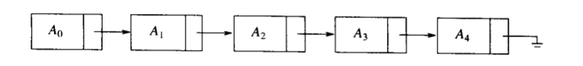

执行printList()或find(x), 我们只需要从链表的第一个结点开始，然后使用next遍历链表即可。与数组一样，这种操作的花费时间是线性的。然而像findKth(i)寻找某个i位置的元素操作花费时间则效率会变低，为O(i)，因为findKth常常按照顺序执行。

remove方法可以通过修改next指向的位置来实现。如删除链表中元素$A_2$.

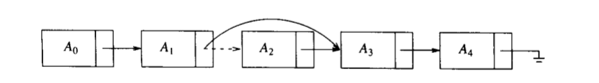

insert方法使用new操作符，从系统申请一个新的结点，并执行两次next调整。如增加新元素X，虚线表示删除原来的链next

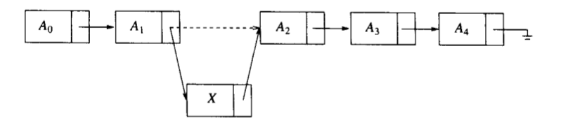

### STL实现的向量和链表

C++提供一个标准模板库(Standard Template Library, STL). 在STL中，链表ADT的实现由两种——vector和list

vector实现了链表ADT的可增长的数组，使用vector可以在常量的时间里索引某个值。但是它在插入新元素和删除已有元素的代价很高，除非操作发生在vector容器末尾。

list实现了链表ADT的双向链表。如果已知发生变化的元素的具体位置，插入和删除操作代价就非常小。但是list不容易索引某个值。

一般STL容器具备的方法：

-   `int size() const `: 返回容器内元素个数。
-   `void clear()`: 删除容器内所有元素。

-   `bool empty()`: 如果容器没有元素，则返回true，否则返回false。

vector和list都支持在常量的时间内在末尾添加或删除项。支持在常量的时间内访问表的前端和尾端的元素：

-   `void push_back(const Object &x)`: 在容器末尾添加x。
-   `void pop_back()`: 删除容器的末尾的 对象。
-   `const Object & back() const`: 返回容器的尾尾的对象。
-   `const Object & front() const `: 返回容器的前端对象。

双向链表list可以高效的改变链表的前端：

-   `void push_front(const Object &x)`: 在双向链表的前端添加x。
-   `void pop_front()` ：删除双向链表的前端的对象。

vector可以进行高效的索引：

-   `Object & operator[] (int idx)`: 返回vector容器中idx索引位置的对象。
-   `Object & at(int idx)`: 返回vector容器中idx索引位置的对象。
-   `int capacity() const`: 返回vector容器内部容量。
-   `void reserve(int new Capacity)`: 设定vector的新容量。

#### 迭代器 Iterator

STL中的迭代器是用来指明当前循环到容器的索引位置，类似于指针变量。

容器中对iterator定义的方法：

`iterator begin()`: 返回指向容器的第一项的迭代器。

`iterator end()`: 返回指向容器的终止的标志，注意是容器最后一个元素的后继位置，不代表实际元素。看起来就是指向了容器边界以外。

迭代器的方法，假设`iterator itr`：

`itr++, ++itr`: 推进迭代器itr到下一个位置。

`*itr`：返回存储在迭代器itr指向位置的对象的引用。

`itr1==itr2`: 是否二者指向同一个位置，若是则返回true， 否则返回false。

`itr1!=itr2`: 与上同理。

需要迭代器的容器操作：

`iterator insert(iterator pos, const Object &x)`: 添加x到表中迭代器pos所指向位置之前的位置。这对list是常量级操作，但是对vector却不是。返回值是指向插入项位置的迭代器。

`iterator erase(iterator pos)`: 删除pos指向位置的对象元素。这对list是常量级操作，对vector则不是。返回值是调用函数之前pos指向元素的下一个对象元素的位置。

`iterator erase(iterator start, iterator end)`: 删除所有从位置start开始直到位置end(左闭右开，不包括end)的所有元素。

**const_iterator**

`const_iterator`的`operator*`返回常量引用，意味着该类型的迭代器的引用`*itr`不能出现在赋值语句的左边。而且，编译器要求必须使用`const_iterator`来遍历常量集合。

#### vector 向量实现

将重新实现的类模板命名为Vector。

Vector是基本数组的可增长形式，通过一个指针变量来分配的内存块。数组的容量和当前的数组内对象数量存储在Vector里。

Vector实现基本函数——`size()，clear()，back()，pop_back，push_back和empty()`，实现复制构造函数和operator=提供深复制。同时提供析构函数回收数组。

Vector提供resize()函数来改变Vector的大小。提供reserve()函数来改变Vector容量。实现方式为给基本数组分配新的更大的内存块，并将旧内存块的内容复制到新块中，最后释放旧块的内存。

Vector提供operator[]的实现

Vector提供支持嵌套的iterator和const_iterator类型，并提供相关联的begin和end方法。

```cpp
template <typename Object>
class Vector{
public:
    explicit Vector(int initSize = 0):theSize(initSize), theCapacity(initSize +
        SPARE_CAPACITY){
            objects = new Object[theCapacity];
        }
    Vector(const Vector & rhs): objects(NULL){
        operator=(rhs);
    }
    ~Vector(){
        delete[] objects;
    }
    
    const Vector & operator= (const Vector &rhs){
        if(this != rhs){
            delete [] objects;
            theSize = rhs.size();
            theCapacity = rhs.theCapacity;
            
            objects = new Object[capacity()];
            for(int k = 0; k < size(); k++)
                objects[k] = rhs.objects[k];
        }
        
        return *this;
    }
    
    Object & operator[] (int index){
        return objects[index];
    }
    const Object & operator[](int index) const{
        return objects[index];
    }
    
    bool empty(){
        return size()==0;
    }
    
    int resize(int newSize){
        if(newSize > theCapacity)
            reserve(newSize*2+1);
        theSize = newSize;
    }
    
    void reserve(int newCapacity){
        if(newCapacity < theSize)
        {
            return ;
        }
        Object *oldArray = objects;
        objects = new Object[newCapacity];
        for(int k = 0; k < theSize; k++){
            objects[k] = *(oldArray+k);
        }
        theCapacity = newCapacity;
        delete [] oldArray;
    }
    
    int capacity() const {
        return theCapacity;
    }
    
    int size() const {
        return theSize;
    }
    
    void push_back(const Object &x){
        if(theSize == theCapacity)
            reserve(2*theCapacity +1);
        objects[theSize++] = x;
    }
    
    void pop_back(){
        theSize--;
    }
    
    const Object & back() const {
        return objects[theSize-1];
    }
    
    typedef Object * iterator;
    typedef const Object * const_iterator;
    
    iterator begin(){
        return &objects[0];
    }
    const iterator begin() const {
        return &objects[0];
    }
    iterator end(){
        return &objects[size()];
    }
    const iterator end() const{
        return &objects[size()];
    }
    
    enum { SPARE_CAPACITY = 16 };
    
private:
    int theSize = 0;
    int theCapacity = 0;
    Object *objects;
};

```

为了实现一个Vector，在其内部设计了已经存储元素的个数theSize，容器的最大容量theCapacity，基本类型数组objects。

Vector类的默认构造函数参数为用户自定义的存储大小，并将其标识为explicit，表明不可隐式转换。重载了运算符 = ，等同于定义了拷贝构造函数，重新定义类内成员基本数组objects，并拷贝源对象的内容到本对象中，返回this指针。

析构函数释放掉基本数组内存空间。

reserve函数用来扩展/缩小容器容量，前提要保证数据不丢失即数据量不能缩小先保存原基本数组指针，向系统申请新的参数为newcapacity大小的基本数组，并将旧数组元素挨个拷贝到新数组，更新容量大小，最后删除旧的数组。

resize函数重新设定容器内使用范围，如果重新设定的范围超过容器容量，那么扩展至二倍大小。

重载operator[]，可以利用[]来进行数据索引

const修饰返回值和类内成员不可更改来标识常量

将模板类型Object的指针类型重新定义为iterator，标识为迭代器。

使用内置类型iterator和`const_iterator`声明的begin方法和end方法，分别返回类内基本数组首个元素地址和数组有效元素后继的起始地址。

#### list 双向链表实现

由于链表的结点是用户从系统堆heap区申请的内存空间，其数量是不定的，所以不能通过指针来增减指向的位置。设计iterator类，该类抽象了位置的概念，是一个公有的嵌套类。该类存储指向某个结点的指针，且尾部是有效位置，所以应该在末尾增加额外的结点。在表的前端也增加一个结点，在逻辑上表示开始，这样会避免某些特例，极大简化代码。额外的结点被称为哨兵结点，头部的结点称为表头结点(header node)，末端的结点称为尾结点(tail node)。

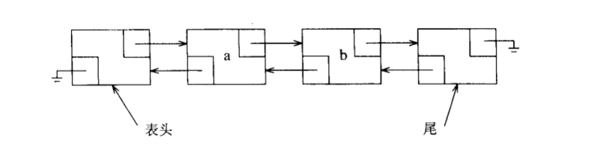

Node类是使用struct声明的，struct是C遗留产物，默认成员为公有；而class默认成员为私有。在List内Node为私有的，外部不能访问之。

```cpp
private:
    struct Node{
        Object data;
        Node *prev;
        Node *next;
        Node(const Object & d = Object(), Node *p = NULL, Node *n = NULL ):
        data(d), prev(p), next(n){}
    };
```

data为结点的数据，prev为指向前驱元素的指针，next为指向后继元素的指针。

Node结构体的构造函数有三个参数，可以定义好三个成员变量。

`iterator`和`const_iterator`区别在于iterator类型的迭代器是可以更改其内部成员的，所以`const_iterator`是基类，`iterator`继承之，重载`*`运算符。

在List类内定义三个数据成员——theSize容器内元素数量，head指向头部结点的指针，tail指向尾部结点的指针。

begin()和end()函数返回迭代器，迭代器的类型是iterator还是const_iterator由声明变量时决定，在定义该函数时，使用const修饰是否改变类内成员即可重载函数类型。返回的迭代器由传入链表表头或表尾元素的指针的构造函数实例化的对象。

**const_iterator类**

```cpp
public:
    class const_iterator{
    public:
        const_iterator(): current(NULL){}
        const Object & operator* () const{
            return retrieve();
        }
        const_iterator & operator++ () {
            current = current->next;
            return *this;
        }
        
        const_iterator operator++ (int){
//            不是通过new 申请heap 后缀运算符先要使用原来的对象，使用完后自加
            const_iterator old = *this;
            // 调用重载过的++运算符
            ++( *this);
            return old;
        }
        
        bool operator== (const const_iterator & rhs) const{
            return current == rhs.current;
        }
        
        bool operator!= (const const_iterator &rhs) const{
            return !(*this==rhs);
        }
        
    protected:
        Node *current;
        
        Object & retrieve() const {
            return current->data;
        }
        const_iterator(Node *p):current(p){}
        
        friend class List<Object>;
    };
```


`const_iterator(Node *p):current(p){}`，这个构造函数是构造指向pNode的迭代器，仅仅在begin和end函数的实现中用到，所以该构造函数不应该被其他外部类访问，所以将其设置为protected成员，只有派生类内才能访问，其他类不允许访问。但是在外部List类begin()和end()成员函数需要访问之，所以声明List类为const_iterator的友元`friend class List<Object>;`，这样外部List就可以访问protected下的构造函数。

current为指向Node类型的指针。是List类用于遍历Node链表的指针，是迭代器指向Node元素的真实指针。

retrieve函数返回当前迭代器指向的Node元素的数据。

const_iterator的公有操作符重载: `==,++,!=,*`，对于++操作符，前缀和后缀是完全不同的，C++通过给前缀形式指定空参数表，后缀形式指定一个匿名int参数来区分。这个int参数永远也不使用，其存在的意义仅仅是给出不同的标识。

`*`解引用，意为读取迭代器指向的元素Object，返回对象的引用，与retrieve()函数一致。

`++`后缀运算符，迭代器Node指针后移一个元素，即current指向next，返回对象的引用。前缀运算符，定义一个局部变量保存旧迭代器的上下文，通过this指针调用后缀自加运算完成指针后移，最后返回旧迭代器的实例，系统会自动回收这类stack区变量。

`==`判断迭代器是否相同，参数为目标迭代器，只需判断二者的实际指针current是否是同一个指针即可。

`!=`调用`==`完成判断。

**iterator类**

继承自const_iterator基类，同样其带参数Node类型指针的构造函数需设置为protected，并声明List类为友元类。

```cpp
class iterator:public const_iterator{
    public:
        iterator(){}
        Object & operator *(){
            return this->retrieve();
        }
        const Object & operator*() const{
            return const_iterator::operator*();
        }
        
        iterator & operator++ (){
            this->current = this->current->next;
            return *this;
        }
        
        iterator & operator-- (){
            this->current = this->current->prev;
            return *this;
        }
        
        iterator operator++ (int){
            iterator old = *this;
            ++(*this);
            return old;
        }
    	iterator operator-- (int){
            iterator old = *this;
            --(*this);
            return old;
        }
        
        
    protected:
        iterator(Node *p):const_iterator(p){}
        friend class List<Object>;
        
    };
```

重载的`*`运算符解引用，返回的引用可以修改其内容。

同时提供const的返回。

其他操作运算符返回类型改变为iterator类型。

**List 类**

类内主要实现构造函数，拷贝构造函数，并通过迭代器完成对链表元素的读取写入等操作。

```cpp
	List(){
        init();
    }
    ~List(){
        clear();
        delete head;
        delete tail;
    }
    List(const List & rhs){
        init();
//        使用重载的=运算符
        *this = rhs;
    }
    
//  const 修饰返回地址不可变
    const List & operator= (const List & rhs){
//        判断地址是否相同来决定是否是同一个对象
        if(this == &rhs){
            return *this;
        }
        clear();
        for(const_iterator it = rhs.begin(); it != rhs.end(); ++it){
            push_back(*it);
        }
        
        return *this;
    }
    
    iterator begin(){
        return iterator(head->next);
    }
    const_iterator begin() const{
        return const_iterator(head->next);
    }
    
    iterator end(){
        return iterator(tail);
    }
    const_iterator end() const{
        return const_iterator(tail);
    }
    
    int size(){
        return theSize;
    }
    bool empty(){
        return size() == 0;
    }
    
    Object & front(){
        return *begin();
    }
    const Object & front() const{
        return *begin();
    }
    Object & back(){
        //        end是界外起始位置 back返回最后一个有效元素
        return *(--end());
    }
    const Object & back() const{
        return *(--end());
    }
    void push_front(const Object & x){
        insert(begin(), x);
    }
    void push_back(const Object & x){
        insert(end(), x);
    }
    void pop_front(){
        erase(begin());
    }
    void pop_back(){
        erase(back());
    }
    iterator insert(iterator it, const Object & x){
        Node *p = it.current;
        theSize++;
        //        插入prev结点的next 即p结点的prev位置
        Node *temp = new Node;
        temp->data = x;
        temp->next = p;
        temp->prev = p->prev;
        p->prev->next = temp;
        p->prev = temp;
        //        浓缩成一句话就是
        //        return iterator(p->prev = p->prev->next = new Node(x, p->prev, p));
        return iterator(temp);
    }
    
    iterator erase(iterator it){
        Node *p = it.current;
        iterator rtnitr(p->next);
        
        p->prev->next = p->next;
        p->next->prev = p->prev;
        delete p;
        theSize--;
        return rtnitr;
    }
    iterator erase(iterator start, iterator end){
        iterator it;
        for(it = start; it != end;){
            earse(it);
        }
        return it;
    }
    
    void clear(){
        while(!empty()){
            pop_front();
        }
    }
private:
    int theSize;
    Node *head;
    Node *tail;
    
    void init(){
        theSize = 0;
        head = new Node;
        tail = new Node;
        head->next = tail;
        tail->prev = head;
    }
    
```

插入元素

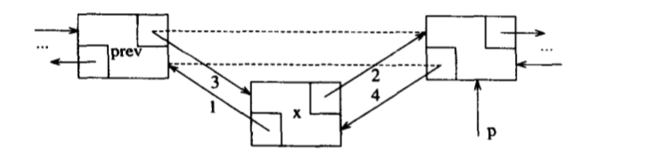

删除元素

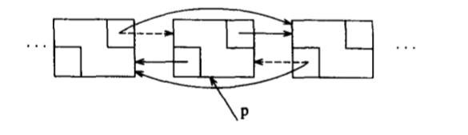

### 栈 stack 

栈是限制插入和删除只能在一个位置上执行的链表，该位置在链表的末端，称之为栈顶top。栈的基本操作有push(入栈)和pop(出栈)，前者相当于插入，后者相当于删除最后的元素。另外对空栈不能执行push和pop操作。栈是先进后出(LIFO)的表。

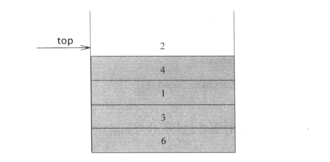

**栈的实现**

由于栈是一个表，所以List和Vector都能实现栈。栈的操作都是常量级操作，基本上不会有优化。

通常pop和push操作在机器指令存在，所以栈可以说是机器上一种最基本的数据结构

**栈的应用**

检验符号是否成对出现

将栈置空，读入字符直到文件结束。如果字符是一个开放符号(符号开始部分)，将其压入栈中。如果字符是一个封闭符号(符号结束那一半)，如果栈为空则报错；栈不空弹出顶端元素，判断是否为对应开放符号，若不是则报错。重复操作直到文件尾。

**后缀表达式**

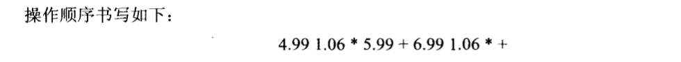

类似于这种表达式，称为后缀(postfix)或逆波兰(reserve Polish notation)表达式。

算法流程为 使用一个栈，当遇到一个数时，就把它压入栈中；遇到操作符时，将该操作符作用于弹出的两个数上，并将结果压入栈中。直到最后只有一个数将其输出。

中缀转换为后缀

当读到一个操作数后，立即将它放到输出

如果遇到一个右括号，将栈的元素弹出，直到一个对应的左括号，注意左括号不输出

其他符号，从栈顶弹出元素，直到发现优先级更低的元素。+的优先级最低，(的优先级最高，同时除了右括号其他情况都不能弹出(。当元素都弹出后，将他们按照弹出顺序写入输出。最后将该符号压入栈。

当读到末尾，将所有元素弹出，写入输出。

核心思想是：当遇到一个操作符时，把它放到栈中，栈表示的是挂起的操作符。然而，当栈中高优先级的操作符完成使用时，则应弹出它们。判断是否完成使用，就是遇到的操作符级别低于栈顶的那部分操作符，表示高级操作已经完成了。

**函数调用**

函数调用和函数返回类似于开括号和闭括号，当存在函数调用时，需要存储的信息，例如寄存器的值和返回地址等以抽象的方式存在于堆(pile)的顶部。随后，控制转移到新的函数，该函数自由控制寄存器等。如果新函数继续调用其他函数，则执行相同的过程。函数返回时，它检查堆顶部的信息，并将寄存器复原，进行返回转移。

所存储的信息称为活动记录(activation record)，或称为帧栈(stack frame). 

### 队列 queue

跟栈一样，队列也是表。然而，队列的插入在一端，删除则是在另外一端。

**队列模型**

队列的基本操作是入队（enqueue）和出队（dequeue）。入队是在标的队尾插入一个元素，出队则是删除并返回表开头的元素。

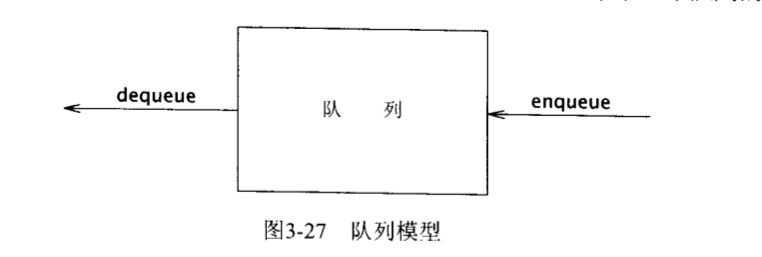

实现方法：

保留一个数组theArray，以及位置front和back分别代表队列的两端。设置currentSize记录实际存在于队列中元素的个数。

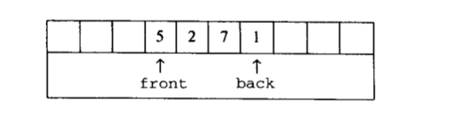

对于操作。enqueue操作，先将currentSize和back自增1，然后置theArray[back]为x。dequeue操作，置返回值为theArray[front]，并将currentSize自减1，front自增1.

对于一定长度的数组，可能在多次操作后两个指针都移动到了 界。这是可以使用循环数组(circular array)

**队列的应用**

打印机文件排队

## 树

对于大量的数据，链表的线性访问时间太长，然而树（tree）结构的操作运行时间则平均为O(logN)

通过递归的方法定义树(tree)，一棵树是一些结点的集合，这个集合可以是空集；若不是空集，则树由根(root)的结点r以及零个或多个非空的子树组成，这些子树中每一颗的根都被来自根r的一条有向边(edge)所连接。

每一颗子树的根结点叫做root结点的孩子(child)，而root结点是每一颗子树的根结点的父亲(parent)。

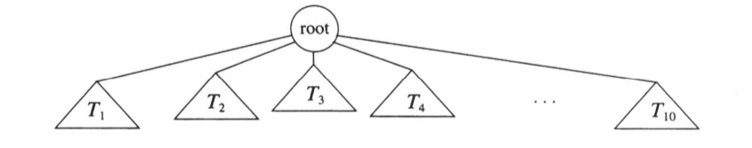

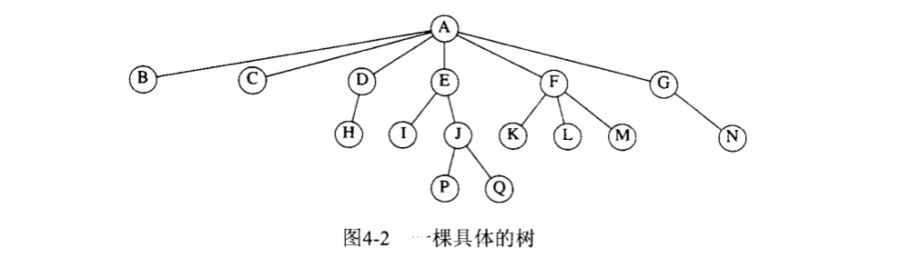

如上图所示结点A是root根结点，没有孩子的结点称为叶子结点(leaf)如I、P、Q等。具有相同父结点的结点称为兄弟结点(sibling)，如K、L、M同属于F，I、J同属于E。

连接结点之间的线称为边(edge)。从结点$n_1到n_k$的一个序列定义为路径(path)。

对任意结点$n_i$，从根结点到$n_i$的唯一路径的长，称为深度(depth)；从$n_i$到一片叶子结点**最长路径**的长称为高(height)。一颗树的高等于它的根结点的高。

### 实现

一般将树结点的数据结构设计成一个结点包含数据元素和指向兄弟结点的指针。

### 二叉树

二叉树（binary tree) 定义为一棵每个结点都不能有多于两个孩子结点的树。

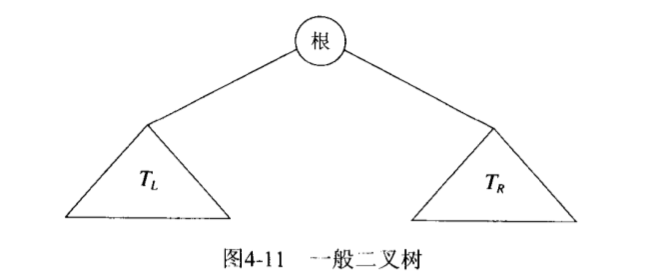

二叉树的一个性质是平均深度要比结点个数N小得多，为$O(\sqrt{N})$.

**实现**

由元素element和两个孩子结点的引用的结构组成

```
template <typename Object>
struct BinaryNode{
    Object element;
    BinaryNode * left;
    BinaryNode * right;
};
```

**应用**

表达式树(expression tree)

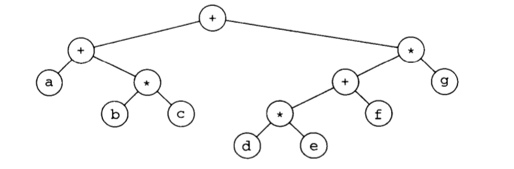

表达式树的叶子结点是操作数（operand），其他结点为操作符(operator)。上图所示的表示的是`(a+(b*c))+(((d*e)+f)*g)`

计算法这种表达式结果的方法有中序遍历(inorder traversal)，即通过递归产生带括号的左表达式，然后访问根处的操作符，最后递归产生带括号的右表达式。

同理的还有后序遍历(postorder traversal)，前序遍历(preorder traversal).

**由后缀表达式构建二叉的表达式树**

假设输入`ab+cde+**`

算法思路，类似于后缀表达式求值，将符号读入，如果符号是 操作数，建立一个单结点的树，并将其压入栈中；如果符号是操作符，从栈中弹出两个子树$T_2和T_1$, 形成一个新的树，该树的根就是操作符，它的左右孩子结点分别是$T_1$和$T_2$，然后将指向这棵新树的指针压入栈中。最后栈中只存在一个树的根结点。

### 二叉查找树

二叉树的一个重要应用就是它在查找中的应用。二叉查找树的性质是，对于树中的每个结点X，它的左子树的所有项的值小于X，而它的右子树中所有项的值大于X。

二叉查找树的平均深度是O(logN)，不必担心栈空间耗尽。

查找基于`<`操作符，该操作符必须在元素类内定义。

#### **接口**

```cpp
template <typename Comparable>
class BinarySearchTree {
private:
    struct BinaryNode{
        Comparable element;
        BinaryNode *left;
        BinaryNode *right;
        
        BinaryNode(const Comparable & theElement, BinaryNode *lf,
                   BinaryNode *rt):element(theElement), left(lf), right(rt){}
    };
    BinaryNode *root;
    
    void insert(const Comparable & x, BinaryNode * & t) const;
    void remove(const Comparable & x, BinaryNode * & t) const;
    BinaryNode * findMin(BinaryNode * t) const;
    BinaryNode * findMax(BinaryNode * t) const;
    bool contains(const Comparable & x, BinaryNode * t) const;
    void makeEmpty(BinaryNode * & t);
    void printTree(BinaryNode * t) const;
    BinaryNode * clone(BinaryNode * t) const;
    
public:
    BinarySearchTree();
    ~BinarySearchTree();
    BinarySearchTree(const BinarySearchTree & rhs);
    
    const Comparable & findMin() const;
    const Comparable & findMax() const;
    bool contains(const Comparable & x) const;
    bool isEmpty() const;
    void printTree() const;
    
    void makeEmpty();
    void insert(const Comparable & x);
    void remove(const Comparable & x);
    
    const BinarySearchTree & operator=(const BinarySearchTree & rhs);
    
    
};

```

在接口中声明了默认构造函数、拷贝构造函数，以及是否存在某个元素、查找最大最小元素，还有插入删除数据等。

#### 是否存在

```cpp
//类内部接口 contains< x, t>
template <typename Comparable>
bool BinarySearchTree<Comparable>::contains(const Comparable & x, BinaryNode *t) const{
//    判断树中是否含有元素值为x的结点
    if(t == NULL){
        return false;
    }
    else if(x < t->element){
//      若树的根结点t的元素值大于x，则去左子树递归查询是否contains
        return contains(x, t->left);
    
    }
    else if(x > t->element){
//      若树的根结点t的元素值小于x，则去右子树递归查询是否contains
        return contains(x, t->right);
    }
    else
//        若相等，则返回true
        return true;
}

// 公共接口 contains
template <typename Comparable>
bool BinarySearchTree<Comparable>::contains(const Comparable &x) const{
//   从根结点root处调用contains函数
    return contains(x, root);
}

```

这里进行了子树的递归调用。

#### 查找最大最小

最小的元素在最左侧结点，所以一直在左子树递归调用，直到NULL为止。或者使用循环的方式，一直迭代到最左侧即做孩子为NULL的。

```cpp
template <typename Comparable>
typename BinarySearchTree<Comparable>::BinaryNode *
BinarySearchTree<Comparable>::findMin(BinaryNode * t) const{
    if(t == NULL)
        return NULL;
    if(t->left == NULL)
        return t;
    return findMin(t->left);
    
    ////        或者使用循环的方式
    //#if 0
    //        if(t != NULL)
    //            while(t->left!=NULL)
    //                t = t->left;
    //        return t;
    //#endif
    
}

template <typename Comparable>
typename BinarySearchTree<Comparable>::BinaryNode *
BinarySearchTree<Comparable>::findMax(BinaryNode * t) const {
    if(t == NULL)
        return NULL;
    if(t->right == NULL)
        return t;
    return findMax(t->right);
}

```

#### insert 插入

为了将x插入到树T中，可以像contains一样，沿着树进行查找，如果找到x则do nothing；否则将x插入到遍历到的路径上的最后一个结点。

```cpp
template <typename Comparable>
void BinarySearchTree<Comparable>::insert(const Comparable & x,
                                            BinaryNode * & t) const{
    if(t == NULL)
        t = new BinaryNode(x, NULL, NULL);
    if(x < t->element)
        insert(x, t->left);
    if(x > t->element)
        insert(x, t->right);
    else
        return;
}

```

#### remove 删除

在一般的数据结构中，删除操作一般是比较复杂的，因为它要考虑几种可能的情况。

如果结点是一片叶子结点，那么它可以立即删除。

如果结点有一个孩子结点，那么在其父结点调整它的链。如删除4结点，而4结点有一个孩子结点3：

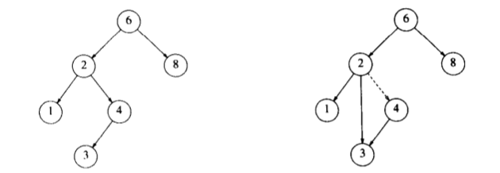

如果结点有两个孩子结点，一般的策略是用右子树的最小结点的数据交换该结点的数据，并递归地删除该结点(交换后该结点必然不包含左子树，因为已经是最小结点的位置)。

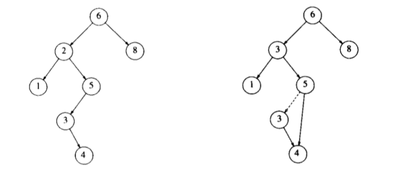

如删除2结点，将其与右子树最小结点3交换，随后删除其在3号位置的结点，此时执行删除只有一个子结点的函数。

#### 删除树

私有的makeEmpty()函数递归地处理t的子树，对t执行delete。最后root置NULL。

```cpp
template <typename Comparable>
void BinarySearchTree<Comparable>::makeEmpty(BinaryNode * & t){
    if(t == NULL)
        return;
    else{
        makeEmpty(t->left);
        makeEmpty(t->right);
        delete t;
    }
//    将t置空
    t = NULL;
}
//公共接口
template <typename Comparable>
void BinarySearchTree<Comparable>::makeEmpty(){
    makeEmpty(root);
}
```


#### 克隆树

对于NULL，直接返回NULL；

创建一个新结点，并将rhs的值拷贝到新结点。对于子树，克隆左右孩子树到自己的左右孩子。

```cpp
//deep copy
template <typename Comparable>
const BinarySearchTree<Comparable> & BinarySearchTree<Comparable>::operator=
    (const BinarySearchTree & rhs){
//    删除原来的树
        makeEmpty();
        root = clone(rhs);
        return *this;
}

// clone a subtree
template <typename Comparable>
typename BinarySearchTree<Comparable>::BinaryNode *
BinarySearchTree<Comparable>::clone(BinaryNode * t) const{
    if(t == NULL)
        return NULL;
    BinaryNode * temp = new BinaryNode;
    temp->element = t->element;
    temp->left = clone(t->left);
    temp->right = clone(t->right);
    return temp;
}

```

同样的重载=运算符，对参数进行拷贝。

